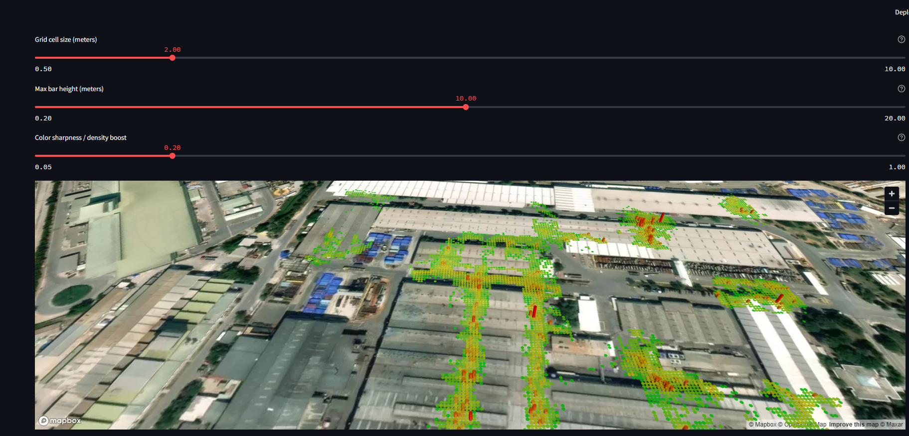

# Tractor Traffic Heatmap – CSV to 3D Density Visualization

**Turn massive GPS datasets into interactive 3D heatmaps in seconds.**  
This app visualizes RTLS or GPS logs (example: Borusan factory vehicles) from simple CSV files. Built with Streamlit and PyDeck, it helps you analyze movement density, traffic flow, or asset activity on a satellite map.

---

## 🚀 Live Demo

 **Try it instantly:**  
[https://traffic-map-daglar510.streamlit.app/](https://traffic-map-daglar510.streamlit.app/)

---

## 📊 Demo Screenshot

  
*Sample: Visualizing demo tractor GPS data at Borusan factory site.*

---

## Features

- **Works with any CSV** containing latitude (`Lat`) and longitude (`Lon`)
- **3D column heatmap** (density per area)
- **Satellite basemap** for real-world context
- **Adjustable grid cell size** (0.5m–10m) for detail or overview
- **Adjustable bar height** for the 3D effect (presentation or flat)
- **Adjustable color sharpness** (density-to-color mapping)
- **Green → Yellow → Red color scale**
- **Automatic colorbar legend with real density values**
- **Interactive tooltips**: Hover to see actual point count in each cell
- **Handles millions of points** efficiently on your PC
- **Runs locally – data never leaves your machine**

---

## Installation

1. **Clone the repository**
    ```bash
    git clone https://github.com/yourusername/tractor-traffic-heatmap.git
    cd tractor-traffic-heatmap
    ```

2. **Install dependencies**
    ```bash
    pip install -r requirements.txt
    ```
    _Needed: `streamlit`, `pydeck`, `pandas`, `matplotlib`, `numpy`_

3. **Place your data**

    - Example file: `gps_data_april2025.csv`
    - File format (CSV, minimum columns):
        ```
        assetId,assetName,updateDate,Lat,Lon
        ...          ...          ...     ...     ...
        ```
    - Use your own GPS/RTLS data. The example is random demo data for Borusan factory vehicles.

4. **Run the app**
    ```bash
    streamlit run app.py
    ```
    - Open the shown local URL in your browser.

---

## Usage

- **Grid cell size:** Use the slider for fine detail (0.5–10 meters)
- **Max bar height:** Adjust 3D column extrusion for effect or clarity
- **Color sharpness:** Boost contrast between high/low density
- **Hover** any grid cell to see how many points are in it
- **Colorbar legend:** Instantly see what count is mapped to which color
- **All sliders are live:** tune them in real-time, even with millions of records

---

## What do the colors mean?

- **Green:** Lowest density (fewest points/cell)
- **Red:** Highest density (most points/cell)
- **Yellow:** Medium density
- **Legend shows**: actual min/max values, so you know what “red” means in your dataset

---

## Example data snippet

```csv
assetId,assetName,updateDate,Lat,Lon
57ee4bdc-6018-418a-bbbb-a116b4bb85e6,16MEH31,2025-04-02T23:44:09,40.40727,29.09322
...
```

---

## License

`MIT LICENSE`.

---

**Questions or feature requests?**  
Open an issue or [try the live demo!](https://traffic-map-daglar510.streamlit.app/)
